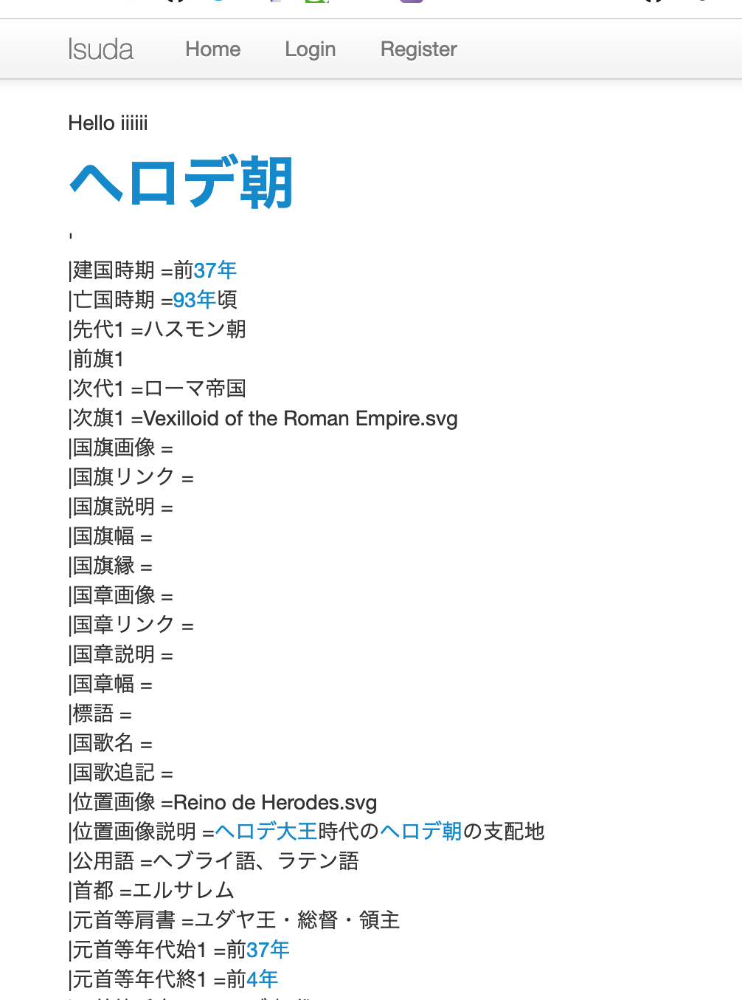

## おい磯野ISUCONやろうぜ!

---

## About me

name: nasa(近藤アサン)

所属: 福岡工業大学, m0neyf0rward

Rust好き〜

福岡生まれ福岡育ち

Twitter: @nasa_desu

GitHub: k-nasa

---

### 今日の注意
- 間違ったことを話してたらマサカリをぶん投げてください
- 初心者向けのお話になります
- 超温かい目で見てください

---

### 今日のまとめ

興味を持ったらISUCONで検索！

チームメンバー、師匠募集!!

---

### ISUCONとは

- I   いい感じ
- SU  スピードアップ
- CON コンテスト

ウェブアプリケーションのチューニングのスコアを競う大会

*賞金100万円!!*

---

### どうやって
- 昨年はConoHa VSPだった
- webサーバーのチューニング
- SQLチューニング
- DBチューニング

---

### 進め方
- ルールを良く読む!! <- まじこれ
  - getは5点,postは10点という配点に気づかなかった
- プロファイリング
  - CPU負荷? or IO待ち?
  - slow log
  - アクセスログ

---

### sar

とりまベンチ 初期スコア2000くらい(python)

Ruby, Goは0 perlは3000

このアプリケーションはCPU負荷

---

### はてなキーワードみたいなアプリ

---
### DB構成

---
### DB構成

- index貼りすぎた
- もともとkeyword, updated_atにindexはなかった
- にもかかわらずゴリゴリ検索されていた
- sql雰囲気なのでexplainで確かめながら実行した
- はったら7000点くらい
- descriptionは17MB位ある -> 破棄したい

---
### Slow log

---

### Slow log

- pt-query-digestで整形して出したログ
- ここはまだ未修正(キャッシュでごまかした)
- charcter_length(keyword)が毎回かかる
- indexうまく使えず、全カラム見ちゃうのです
- keyword_lenthカラムを作って入れておくで解決？

---

### Nginx log

---

### Nginx log
- alpというツールでログが整形して見れる
- '/'がめっちゃ重い
- キーワードを正規表現で置換しているコードがありそこがめちゃめちゃ遅い

Go,Rubyがfailになる理由はこれだった

ちなみにperlは早かった

---

### 正規表現高速化

- できなかった,,,,
- キャッシュでごまかした

19000点になった (ファッ！)

- キャッシュ破棄を最適化して

25000点くらいまで

### 予選突破した！

### 皆さん強すぎる

